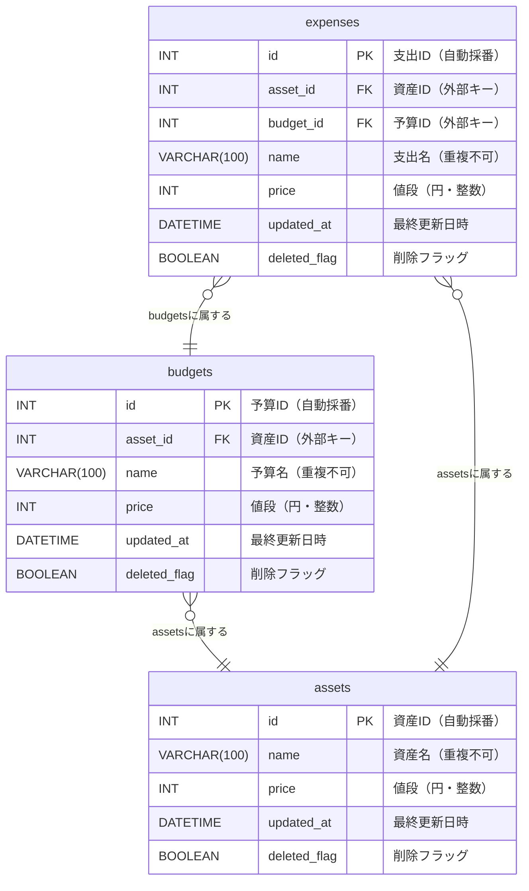

# データベース設計書

---

## 0. 基本情報

| 項目           | 内容                         |
|----------------|------------------------------|
| システム名     | Monage                       |
| データベース名 | monage                       |
| DB種別         | MariaDB 10.5                 |
| ホスト名       | localhost                    |
| ポート番号     | 3306                         |
| ユーザー名     | user                         |
| 接続方法       | TCP/IP                       |

---

## 1. テーブル一覧

| テーブル名 | 論理名 | 説明                       |
| ---------- | ------ | -------------------------- |
| assets     | 資産   | 資産を管理するテーブルです |
| budgets    | 予算   | 予算を管理するテーブルです |
| expenses   | 支出   | 支出を管理するテーブルです |

---

## 2. テーブル定義

### assets（資産テーブル）

| カラム名       | データ型       | NOT NULL | 主キー | デフォルト                                           | その他制約 | 説明                            |
| -------------- | -------------- | -------- | ------ | ---------------------------------------------------- | ---------- | ------------------------------- |
| `id`           | `INT UNSIGNED` | YES      | YES    | `AUTO_INCREMENT`                                     |            | 資産ID（自動採番）              |
| `name`         | `VARCHAR(100)` | YES      |        |                                                      | `UNIQUE`   | 資産名（最大100文字、重複不可） |
| `price`        | `INT UNSIGNED` | YES      |        |                                                      |            | 値段（円・整数）                |
| `updated_at`   | `DATETIME`     | YES      |        | `CURRENT_TIMESTAMP`<br>`ON UPDATE CURRENT_TIMESTAMP` |            | 最終更新日時（自動更新）        |
| `deleted_flag` | `BOOLEAN`      | YES      |        | `FALSE`                                              |            | 削除フラッグ                    |

---

### budgets（予算テーブル）

| カラム名       | データ型       | NOT NULL | 主キー | 外部キー                      | デフォルト                                           | その他制約                                 | 説明                  |
| -------------- | -------------- | -------- | ------ | ----------------------------- | ---------------------------------------------------- | ------------------------------------------ | --------------------- |
| `id`           | `INT UNSIGNED` | YES      | YES    |                               | `AUTO_INCREMENT`                                     |                                            | 予算ID（自動採番）    |
| `asset_id`     | `INT UNSIGNED` | YES      |        | `REFERENCES assets(asset_id)` |                                                      | `ON DELETE CASCADE`<br>`ON UPDATE CASCADE` | 資産ID（外部キー）    |
| `name`         | `VARCHAR(100)` | YES      |        |                               |                                                      | `UNIQUE`                                   | 予算名（最大100文字） |
| `price`        | `INT UNSIGNED` | YES      |        |                               |                                                      |                                            | 値段（円・整数）      |
| `updated_at`   | `DATETIME`     | YES      |        |                               | `CURRENT_TIMESTAMP`<br>`ON UPDATE CURRENT_TIMESTAMP` |                                            | 最終更新日時          |
| `deleted_flag` | `BOOLEAN`      | YES      |        |                               | `FALSE`                                              |                                            | 削除フラッグ          |

---

### expenses（支出テーブル）

| カラム名     | データ型       | NOT NULL | 主キー | 外部キー                        | デフォルト                                           | その他制約                                 | 説明                  |
| ------------ | -------------- | -------- | ------ | ------------------------------- | ---------------------------------------------------- | ------------------------------------------ | --------------------- |
| `id`         | `INT UNSIGNED` | YES      | YES    |                                 | `AUTO_INCREMENT`                                     |                                            | 支出ID（自動採番）    |
| `asset_id`   | `INT UNSIGNED` | YES      |        | `REFERENCES assets(asset_id)`   |                                                      | `ON DELETE CASCADE`<br>`ON UPDATE CASCADE` | 資産ID（外部キー）    |
| `budget_id`  | `INT UNSIGNED` | YES      |        | `REFERENCES budgets(budget_id)` |                                                      | `ON DELETE CASCADE`<br>`ON UPDATE CASCADE` | 予算ID（外部キー）    |
| `name`       | `VARCHAR(100)` | YES      |        |                                 |                                                      | `UNIQUE`                                   | 支出名（最大100文字） |
| `price`      | `INT UNSIGNED` | YES      |        |                                 |                                                      |                                            | 値段（円・整数）      |
| `created_at` | `DATETIME`     | YES      |        |                                 | `CURRENT_TIMESTAMP`                                  |                                            | 登録日時              |
| `updated_at` | `DATETIME`     | YES      |        |                                 | `CURRENT_TIMESTAMP`<br>`ON UPDATE CURRENT_TIMESTAMP` |                                            | 最終更新日時          |
| `deleted_flag` | `BOOLEAN`      | YES      |        |                               | `FALSE`                                              |                                            | 削除フラッグ          |

---

## 3. リレーション定義

| リレーション                         | 関係       | 説明                                    |
| ------------------------------------ | ---------- | --------------------------------------- |
| `assets.id` → `budgets.asset_id`    | 1対多 (1\:N) | 1つの資産に対して複数の予算が関連づく |
| `assets.id` → `expenses.asset_id`   | 1対多 (1\:N) | 1つの資産に対して複数の支出が関連づく |
| `budgets.id` → `expenses.budget_id` | 1対多 (1\:N) | 1つの予算に対して複数の支出が関連づく |

---

## 4. ER図



---

## 5. テーブルのデータ例

### assets（資産テーブル）

| id | name         | price   | updated_at          | deleted_flag |
| -- | ------------ | ------- | --------------------| ------------ |
|  1 | `所持金`     | 21,000  | `2025-05-01 09:00:00` | FALSE        |
|  2 | `足利銀行`   | 10,000  | `2025-05-02 10:00:00` | FALSE        |
|  3 | `みずほ銀行` | 210,000 | `2025-05-03 11:00:00` | FALSE        |

### budgets（予算テーブル）

| id | asset_id | name   | price   | updated_at            | deleted_flag |
| -- | -------- | ------ | ------- | --------------------- | ------------ |
|  1 |        1 | `家賃` | 100,000 | `2025-05-01 09:00:00` | FALSE        |
|  2 |        1 | `食費` | 20,000  | `2025-05-02 11:00:00` | FALSE        |
|  3 |        2 | `趣味` | 10,000  | `2025-05-03 12:00:00` | FALSE        |

### expenses（支出テーブル）

| id | asset_id | budget_id | name           | price   | updated_at              | deleted_flag |
| -- | -------- | --------- | -------------- | ------- | ----------------------- | ------------ |
|  1 |        1 |         1 | `ラーメン`       | 100,000 | `2025-05-01 09:00:00` | FALSE        |
|  2 |        1 |         1 | `リンゴジュース` | 20,000  | `2025-05-02 11:00:00` | FALSE        |
|  3 |        2 |         2 | `グミ`           | 10,000  | `2025-05-03 12:00:00` | FALSE        |

---

## 6. クエリ文の例

### monage（monageデータベース）

CREATE

```sql
CREATE DATABASE monage;
```

DROP

```sql
DROP DATABASE monage;
```

### assets（資産テーブル）

CREATE

```sql
CREATE TABLE assets (
    id INT UNSIGNED NOT NULL AUTO_INCREMENT,
    name VARCHAR(100) NOT NULL UNIQUE,
    price INT UNSIGNED NOT NULL,
    updated_at DATETIME NOT NULL DEFAULT CURRENT_TIMESTAMP ON UPDATE CURRENT_TIMESTAMP,
    deleted_flag BOOLEAN NOT NULL DEFAULT FALSE,
    PRIMARY KEY (id)
);
```

INSERT

```sql
INSERT INTO assets (name, price)
VALUES ('ノートパソコン', 150000);
```

UPDATE（名前と価格を変更）

```sql
UPDATE assets
SET name = 'ゲーミングPC', price = 200000
WHERE id = 1;
```

SELECT（全件）

```sql
SELECT * FROM assets;
```

SELECT（条件付き、未削除データのみ）

```
SELECT * FROM assets
WHERE deleted_flag = FALSE;
```

論理削除（deleted_flag を TRUE に）

```sql
DELETE FROM assets
WHERE id = 1;
```

物理削除

```sql
DELETE FROM assets
WHERE id = 1;
```

完全削除

```sql
DROP TABLE IF EXISTS assets;
```

### budgets（予算テーブル）

CREATE

```sql
CREATE TABLE budgets (
    id INT UNSIGNED NOT NULL AUTO_INCREMENT,
    asset_id INT UNSIGNED NOT NULL,
    name VARCHAR(100) NOT NULL UNIQUE,
    price INT UNSIGNED NOT NULL,
    updated_at DATETIME NOT NULL DEFAULT CURRENT_TIMESTAMP ON UPDATE CURRENT_TIMESTAMP,
    deleted_flag BOOLEAN NOT NULL DEFAULT FALSE,
    PRIMARY KEY (id),
    CONSTRAINT fk_budgets_asset
        FOREIGN KEY (asset_id)
        REFERENCES assets(id)
        ON DELETE CASCADE
        ON UPDATE CASCADE
);
```

INSERT

```sql
INSERT INTO budgets (asset_id, name, price)
VALUES (1, '開発予算', 50000);
```

UPDATE（名前と価格を変更）
```sql
UPDATE budgets
SET name = '研究開発費', price = 60000
WHERE id = 1;
```

SELECT（全件）

```sql
SELECT * FROM budgets;
```

SELECT（特定資産IDかつ未削除）
```sql
SELECT * FROM budgets
WHERE asset_id = 1 AND deleted_flag = FALSE;
```

論理削除

```sql
UPDATE budgets
SET deleted_flag = TRUE
WHERE id = 1;
```

物理削除

```sql
DELETE FROM budgets
WHERE id = 1;
```

完全削除

```sql
DROP TABLE IF EXISTS budgets;
```

### expens（支出テーブル）

CREATE

```sql
CREATE TABLE expenses (
    id INT UNSIGNED NOT NULL AUTO_INCREMENT,
    asset_id INT UNSIGNED NOT NULL,
    budget_id INT UNSIGNED NOT NULL,
    name VARCHAR(100) NOT NULL UNIQUE,
    price INT UNSIGNED NOT NULL,
    created_at DATETIME NOT NULL DEFAULT CURRENT_TIMESTAMP,
    updated_at DATETIME NOT NULL DEFAULT CURRENT_TIMESTAMP ON UPDATE CURRENT_TIMESTAMP,
    deleted_flag BOOLEAN NOT NULL DEFAULT FALSE,
    PRIMARY KEY (id),
    CONSTRAINT fk_expenses_asset
        FOREIGN KEY (asset_id)
        REFERENCES assets(id)
        ON DELETE CASCADE
        ON UPDATE CASCADE,
    CONSTRAINT fk_expenses_budget
        FOREIGN KEY (budget_id)
        REFERENCES budgets(id)
        ON DELETE CASCADE
        ON UPDATE CASCADE
);
```

INSERT

```sql
INSERT INTO expenses (asset_id, budget_id, name, price)
VALUES (1, 1, 'ソフトウェア購入', 10000);
```

UPDATE（支出名と価格を変更）

```sql
UPDATE expenses
SET name = 'Adobe購入', price = 12000
WHERE id = 1
```

論理削除

```sql
UPDATE expenses
SET deleted_flag = TRUE
WHERE id = 1;
```

SELECT（全件）

```sql
SELECT * FROM expenses;
```

SELECT（条件付き：未削除かつ特定のbudget_id）

```sql
SELECT * FROM expenses
WHERE budget_id = 1 AND deleted_flag = FALSE;
```

物理削除

```sql
DELETE FROM expenses
WHERE id = 1;
```

完全削除

```sql
DROP TABLE IF EXISTS expenses;
```