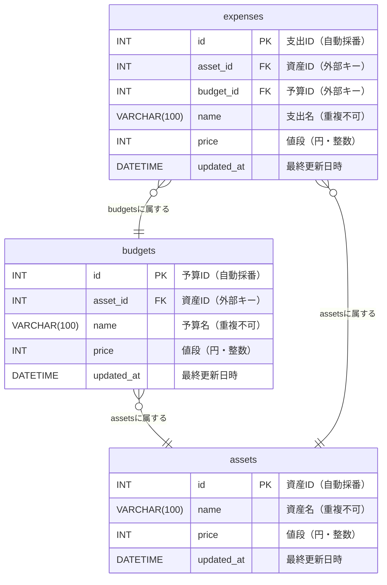

# 📘 データベース設計書

---

## 0. 基本情報

| 項目           | 内容                         |
|----------------|------------------------------|
| システム名     | Monage                       |
| データベース名 | monage                       |
| DB種別         | MariaDB 10.5                 |
| ホスト名       | localhost                    |
| ポート番号     | 3306                         |
| ユーザー名     | user                         |
| 接続方法       | TCP/IP                       |

---

## 1. テーブル一覧

| テーブル名 | 論理名 | 説明                       |
| ---------- | ------ | -------------------------- |
| assets     | 資産   | 資産を管理するテーブルです |
| budgets    | 予算   | 予算を管理するテーブルです |
| expenses   | 支出   | 支出を管理するテーブルです |

---

## 2. テーブル定義

### assets（資産テーブル）

| カラム名     | データ型       | NOT NULL | 主キー | デフォルト                                           | その他制約 | 説明                            |
| ------------ | -------------- | -------- | ------ | ---------------------------------------------------- | ---------- | ------------------------------- |
| `id`         | `INT UNSIGNED` | YES      | YES    | `AUTO_INCREMENT`                                     |            | 資産ID（自動採番）              |
| `name`       | `VARCHAR(100)` | YES      |        |                                                      | `UNIQUE`   | 資産名（最大100文字、重複不可） |
| `price`      | `INT UNSIGNED` | YES      |        |                                                      |            | 値段（円・整数）                |
| `updated_at` | `DATETIME`     | YES      |        | `CURRENT_TIMESTAMP`<br>`ON UPDATE CURRENT_TIMESTAMP` |            | 最終更新日時（自動更新）        |

---

### budgets（予算テーブル）

| カラム名     | データ型       | NOT NULL | 主キー | 外部キー                      | デフォルト                                           | その他制約                                 | 説明                  |
| ------------ | -------------- | -------- | ------ | ----------------------------- | ---------------------------------------------------- | ------------------------------------------ | --------------------- |
| `id`         | `INT UNSIGNED` | YES      | YES    |                               | `AUTO_INCREMENT`                                     |                                            | 予算ID（自動採番）    |
| `asset_id`   | `INT UNSIGNED` | YES      |        | `REFERENCES assets(asset_id)` |                                                      | `ON DELETE CASCADE`<br>`ON UPDATE CASCADE` | 資産ID（外部キー）    |
| `name`       | `VARCHAR(100)` | YES      |        |                               |                                                      | `UNIQUE`                                   | 予算名（最大100文字） |
| `price`      | `INT UNSIGNED` | YES      |        |                               |                                                      |                                            | 値段（円・整数）      |
| `updated_at` | `DATETIME`     | YES      |        |                               | `CURRENT_TIMESTAMP`<br>`ON UPDATE CURRENT_TIMESTAMP` |                                            | 最終更新日時          |


---

### expenses（支出テーブル）

| カラム名     | データ型       | NOT NULL | 主キー | 外部キー                        | デフォルト                                           | その他制約                                 | 説明                  |
| ------------ | -------------- | -------- | ------ | ------------------------------- | ---------------------------------------------------- | ------------------------------------------ | --------------------- |
| `id`         | `INT UNSIGNED` | YES      | YES    |                                 | `AUTO_INCREMENT`                                     |                                            | 支出ID（自動採番）    |
| `asset_id`   | `INT UNSIGNED` | YES      |        | `REFERENCES assets(asset_id)`   |                                                      | `ON DELETE CASCADE`<br>`ON UPDATE CASCADE` | 資産ID（外部キー）    |
| `budget_id`  | `INT UNSIGNED` | YES      |        | `REFERENCES budgets(budget_id)` |                                                      | `ON DELETE CASCADE`<br>`ON UPDATE CASCADE` | 予算ID（外部キー）    |
| `name`       | `VARCHAR(100)` | YES      |        |                                 |                                                      | `UNIQUE`                                   | 支出名（最大100文字） |
| `price`      | `INT UNSIGNED` | YES      |        |                                 |                                                      |                                            | 値段（円・整数）      |
| `created_at` | `DATETIME`     | YES      |        |                                 | `CURRENT_TIMESTAMP`                                  |                                            | 登録日時              |
| `updated_at` | `DATETIME`     | YES      |        |                                 | `CURRENT_TIMESTAMP`<br>`ON UPDATE CURRENT_TIMESTAMP` |                                            | 最終更新日時          |

---

## 3. ER図



## 4. リレーション定義

| リレーション              | 関係        | 説明                          |
| ------------------------- | ----------- | ----------------------------- |
| users.id → tasks.user_id | 1対多 (1:N) | 1ユーザーが複数のタスクを持つ |

---

## 5. インデックス・制約

### users テーブル

- `PRIMARY KEY (id)`
- `UNIQUE (email)`

### tasks テーブル

- `PRIMARY KEY (id)`
- `FOREIGN KEY (user_id) REFERENCES users(id)`

---

## 6. 論理削除フラグについて

- `deleted` カラムを全テーブルに追加し、削除処理は論理削除で対応します。
- 削除状態のレコードは `deleted = TRUE`。
- 有効なデータ取得時は `WHERE deleted = FALSE` を条件に含める。

---

## 7. クエリ文の例

### INSERT

```sql
INSERT INTO users (name, email, password)
VALUES ('山田太郎', 'taro@example.com', 'hashedpassword');
```

### SELECT（論理削除考慮）

```sql
SELECT * FROM tasks
WHERE user_id = 1 AND deleted = FALSE
ORDER BY due_date ASC;
```

### 論理削除

```sql
UPDATE users
SET deleted = TRUE
WHERE id = 3;
```

## 8. 備考・運用ルール

パスワードはハッシュ化（bcrypt推奨）

作成・更新日時は created_at, updated_at で記録（必要なら deleted_at も）

クエリは原則 deleted = FALSE を条件に含めること

ENUMカラムはマスターテーブル化も検討可能

---

## 9. テーブルのデータ例

### 📄 users（ユーザーテーブル）

| id | name      | email              | password         | deleted | created_at          |
|----|-----------|--------------------|------------------|---------|---------------------|
| 1  | 山田太郎  | taro@example.com   | hashed_abc123    | FALSE   | 2025-05-01 09:00:00 |
| 2  | 鈴木花子  | hanako@example.com | hashed_xyz789    | FALSE   | 2025-05-02 10:00:00 |
| 3  | 渡辺健    | ken@example.com    | hashed_aaa111    | TRUE    | 2025-05-03 11:00:00 |

---

### 📄 tasks（タスクテーブル）

| id | user_id | title                | description        | status | due_date   | deleted | created_at          |
|----|---------|----------------------|--------------------|--------|------------|---------|---------------------|
| 1  | 1       | 買い物               | スーパーで食材購入 | todo   | 2025-05-15 | FALSE   | 2025-05-10 09:30:00 |
| 2  | 1       | 本を読む             | 技術書1章〜3章まで | doing  | 2025-05-12 | FALSE   | 2025-05-10 10:00:00 |
| 3  | 2       | 散歩                 | 朝の運動           | done   | 2025-05-11 | FALSE   | 2025-05-10 07:00:00 |
| 4  | 3       | プロジェクト資料作成 | クライアント用     | todo   | 2025-05-20 | TRUE    | 2025-05-09 20:00:00 |